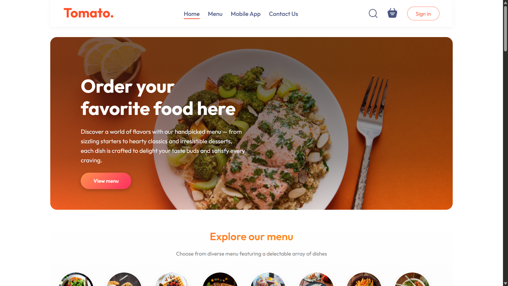
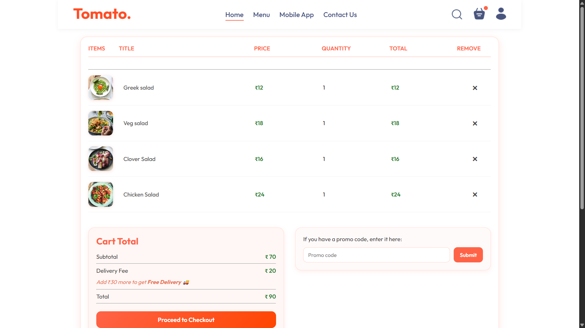
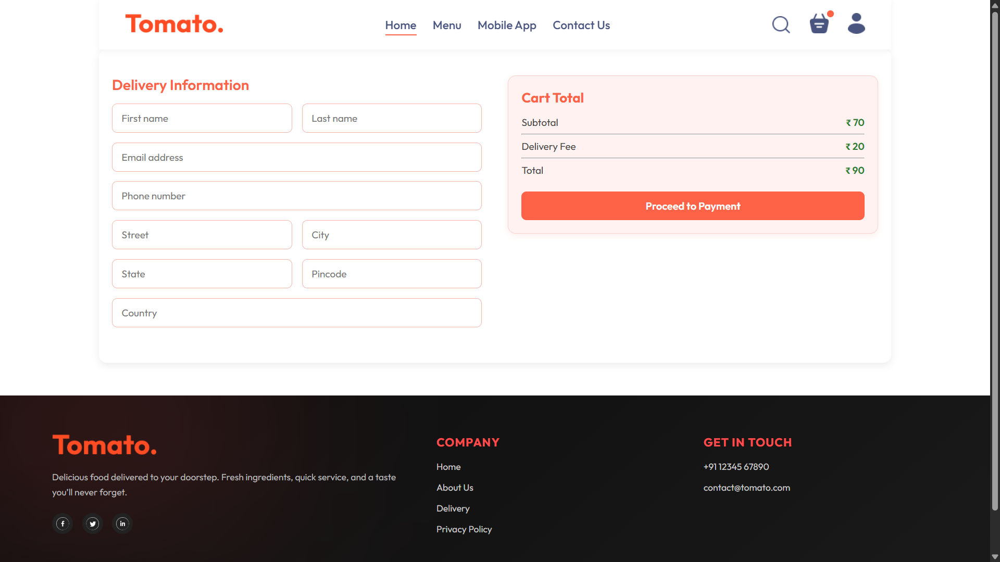
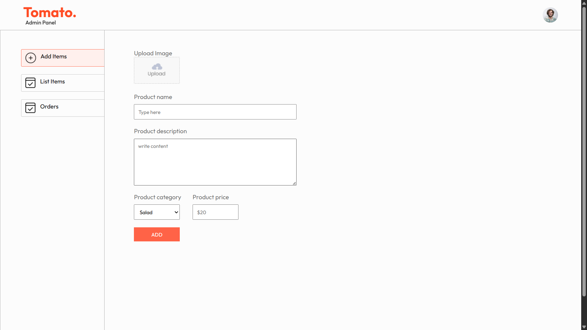
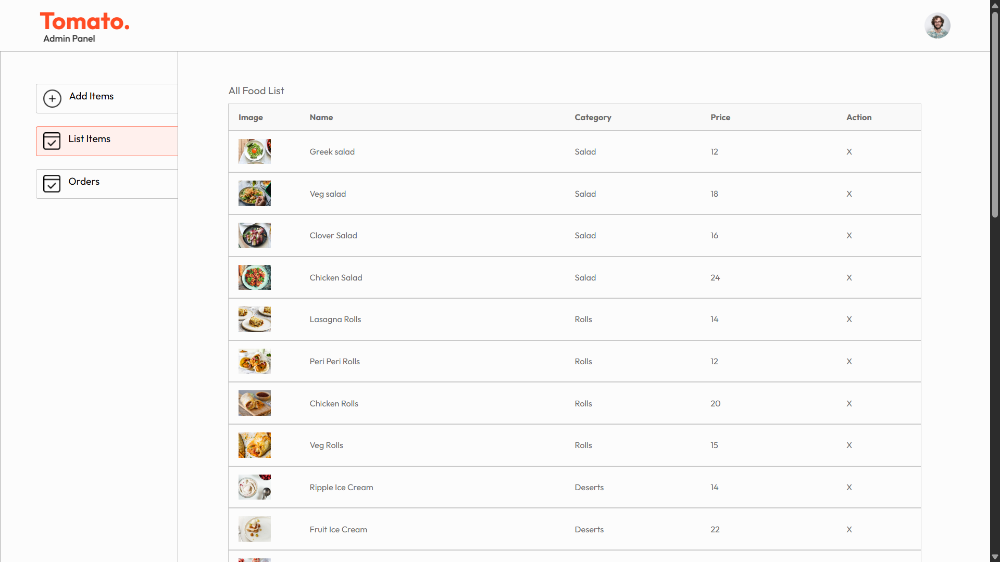

# 🍅 Tomato – Food Delivery Website

Tomato is a **full-stack food delivery web application** where users can browse food items, manage their cart, and place orders using online payments.  
It also includes a **separate admin panel** for managing food items and orders.

The application is fully deployed and live.

---

## 🔗 Live Demo

- **Store Front (User App)**  
  👉 [https://tomato-food-delivery-website-ivory.vercel.app/](https://tomato-food-delivery-website-ivory.vercel.app/)

- **Admin Panel**  
  👉 [https://tomato-food-delivery-website-4qcr.vercel.app/](https://tomato-food-delivery-website-4qcr.vercel.app/)

---

## � Screenshots

### 🛍️ Store Front
  
*Home Page*

  
*Food Listing*

  
*Cart Page*

  
*Checkout Page*

### 🛠️ Admin Panel
  
*Admin Dashboard*

  
*Add / Delete Food Items*

  
*Order Management*

---

## 🛠️ Tech Stack

### **Frontend (Store & Admin)**
- React.js (Vite)
- React Router DOM (v7)
- React Hooks
- Axios
- React Toastify (Admin)
- CSS / CSS3

### **Backend**
- Node.js
- Express.js
- MongoDB (Mongoose)
- JWT Authentication
- bcrypt
- Multer
- Validator

### **Payment Integration**
- Stripe
- Razorpay

---

## 🚀 Features

### 👤 User Features
- User login and registration
- Browse food items by category
- Add, remove, and update cart items
- Place orders with online payment
- Fully responsive design

### 🛠️ Admin Features
- Secure admin dashboard
- Add and remove food items
- Upload food images
- View and manage orders
- Update order status

---

## 📂 Project Structure

```
/
├── admin/      # Admin panel (React + Vite)
├── Backend/    # Backend API (Node.js + Express)
├── FrontEnd/   # Customer-facing store (React + Vite)
```

---

## ⚙️ Installation & Run Locally

1. **Clone the repository**
   ```bash
   git clone https://github.com/your-username/tomato-food-delivery.git
   cd tomato-food-delivery
   ```

2. **Setup Backend**
   ```bash
   cd Backend
   npm install
   ```
   - Create a `.env` file in the `Backend` directory and add your environment variables (e.g., `MONGO_URI`, `JWT_SECRET`, `STRIPE_SECRET_KEY`, etc.).
   - Start the server:
     ```bash
     npm run server
     ```

3. **Setup Frontend (Store)**
   ```bash
   cd ../FrontEnd
   npm install
   npm run dev
   ```

4. **Setup Admin Panel**
   ```bash
   cd ../admin
   npm install
   npm run dev
   ```

---

## 📚 What I Learned

- Building scalable REST APIs with Express
- Implementing JWT-based authentication
- Full-stack state management using React Hooks
- Integrating real-world payment gateways
- Designing admin & user role-based dashboards
- Deploying full-stack applications
